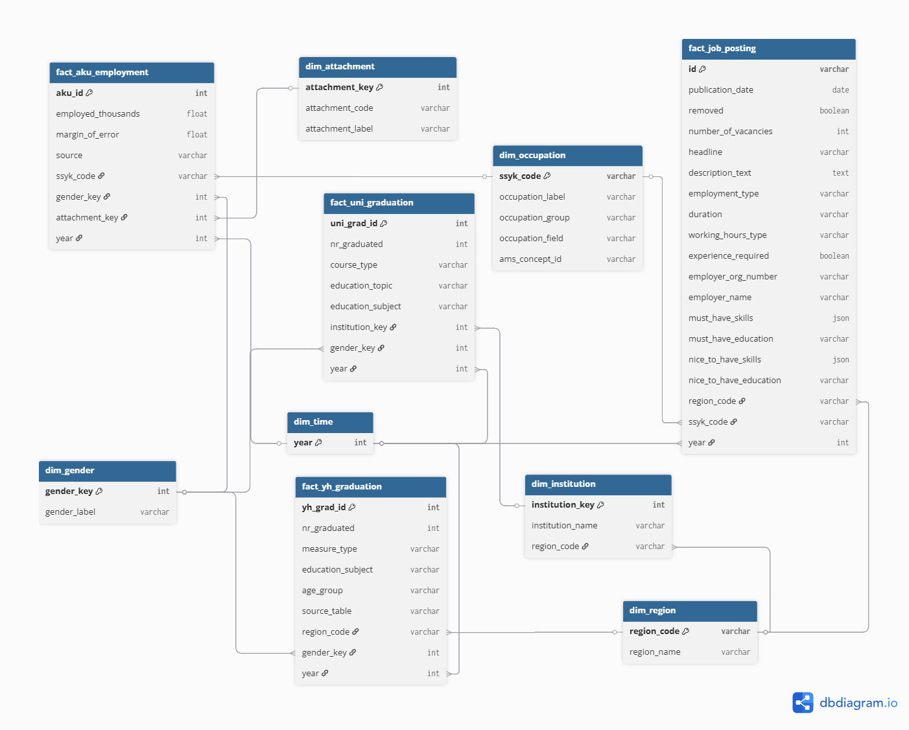

# Conceptual Data Model

---

### How the datasets connect

>There are three sources and only two real join keys at MVP stage.

**Join 1: region** (`dim_region.region_code`)
This is your primary analytical axis. Job postings carry a region code natively. YH graduation data carries a region code natively. University data does not — you'll assign a region to each institution manually in `dim_institution` during transformation. Once that mapping exists, all three sources are comparable by region.

**Join 2:  year**  `(dim_time.year)`
All three sources have a year. It's an int column directly on each fact table — no dimension needed. This is your time axis for trend analysis.

**What does NOT connect directly**
Occupation (job postings) and education subject (graduation data) use different taxonomies and cannot be joined without a crosswalk. That crosswalk doesn't exist yet and is out of scope for ingestion. This needs to be solved during transformation.

---

### Common keys 

| Key             | Sources it connects                                                                       |
| --------------- | ----------------------------------------------------------------------------------------- |
| `year`        | All sources                                                                               |
| `region_code` | Job postings, YH graduation, uni graduation (via institution), future AKU/employment data |
| `ssyk_code`   | Job postings, future employment stats, AKU, occupation-level labour market data           |
| `gender_key`  | YH graduation, uni graduation, future AKU and labour status data                          |

---

### Key Transformations Needed

**Education**

>* Cast `nr_graduated` from string to INT in both SCB and UKÄ sources - strip dashes, dots, and nulls
>* Parse `Tidsperiod` in UKÄ from string to year INT
>* Split SCB's combined `region_name` field into region code and region label
>* Decide on `totalt` gender rows - keep as-is or derive at query time (ensure there's no double-counting)
>* Map `lärosäte` (UKÄ institution names) to `region_code` manually - build and version-control this as a seed CSV

**Occupation**

>* Map Arbetsförmedlingen `occupation.concept_id` and `legacy_ams_taxonomy_id` to SSYK: source the AMS → SSYK mapping on SCB or use AI.

**Geography**

>* Standardise region codes across sources - confirm SCB LA21 codes align with Arbetsförmedlingen `region_code` values before joining

**Deferred to v2**

>* Parse `must_have` and `nice_to_have` nested JSON arrays into a normalised skills structure - ingest as raw JSON to begin with
>* Build education subject mapping between SCB YH `utbildningens inriktning` and UKÄ `huvudområdesgrupp` - required for supply vs demand analysis by field of study
